<div align="center">

# 🐍 Python Learning Roadmap


<p align="center">
  
  
  
  
</p>

<p align="center">
  
  
  
</p>

<p align="center">
  <a href="#-نظرة-عامة">نظرة عامة</a> •
  <a href="#-المميزات">المميزات</a> •
  <a href="#-التثبيت-والتشغيل">التثبيت</a> •
  <a href="#-المراحل-التعليمية">المراحل</a> •
  <a href="#-المساهمة">المساهمة</a>
</p>

</div>


<br>

## 📋 نظرة عامة

<div align="center">

```ascii
╔══════════════════════════════════════════════════════════════╗
║  منصة تعليمية تفاعلية لتعلم Python من الصفر إلى الاحتراف  ║
╚══════════════════════════════════════════════════════════════╝
```

</div>

<table>
<tr>
<td width="50%">

### 🎯 الهدف
مساعدة المبتدئين في تعلم لغة البرمجة Python بطريقة **منظمة ومتدرجة** من خلال خارطة طريق واضحة ومراحل تعليمية متسلسلة.

</td>
<td width="50%">

### 💡 المحتوى
كل مرحلة تحتوي على:
- ✅ شروحات تفصيلية
- ✅ تمارين عملية
- ✅ أمثلة تطبيقية
- ✅ تقييم للمهارات

</td>
</tr>
</table>


## ✨ المميزات

<div align="center">

| الميزة | الوصف | التقنية |
|:------:|:------|:-------:|
| 🎯 | **خارطة طريق واضحة** - مسار تعليمي منظم من المبتدئ إلى المحترف | React Router |
| 🔓 | **نظام فتح المراحل** - تقدم تدريجي مع فتح المراحل بالتسلسل | State Management |
| 🎨 | **تصميم عصري** - واجهة مستخدم جذابة وسهلة الاستخدام | CSS Modules |
| 🌙 | **الوضع الليلي** - دعم كامل للوضع الداكن | CSS Variables |
| 📱 | **متجاوب تماماً** - يعمل بشكل مثالي على جميع الأجهزة | Responsive Design |
| ⚡ | **أداء سريع** - مبني باستخدام Vite و React | Vite + React 18 |
| 🇸🇦 | **دعم اللغة العربية** - واجهة كاملة باللغة العربية مع دعم RTL | RTL Support |
| 🎭 | **رسوم متحركة سلسة** - تجربة مستخدم تفاعلية | Framer Motion |

</div>


## 🛠️ التقنيات المستخدمة

<div align="center">

### Frontend Framework

<p>
  
</p>

| التقنية | الإصدار | الاستخدام |
|:-------:|:-------:|:----------|
|  | 18.2 | مكتبة JavaScript لبناء واجهات المستخدم |
|  | 6.20 | للتنقل بين الصفحات |
|  | 10.16 | للرسوم المتحركة والانتقالات |
|  | Latest | مكتبة أيقونات حديثة |

### Build Tools & Quality

<p>
  
</p>

| الأداة | الوصف |
|:------:|:------|
|  | أداة بناء سريعة وحديثة |
|  | للحفاظ على جودة الكود |

</div>


## 📦 التثبيت والتشغيل

### ⚙️ المتطلبات الأساسية

<div align="center">

| المتطلب | الإصدار المطلوب | التحميل |
|:-------:|:---------------:|:-------:|
|  | 16+ | [تحميل](https://nodejs.org/) |
|  | 8+ | يأتي مع Node.js |

</div>

### خطوات التثبيت

1. **استنساخ المشروع**
```bash
git clone https://github.com/abdessamad159/Python-Learning-Roadmap.git
cd Python-Learning-Roadmap
```

2. **تثبيت الحزم**
```bash
npm install
```

3. **تشغيل المشروع في وضع التطوير**
```bash
npm run dev
```

4. **فتح المتصفح**
افتح المتصفح على العنوان: `http://localhost:5173`

### أوامر إضافية

```bash
# بناء المشروع للإنتاج
npm run build

# معاينة النسخة النهائية
npm run preview

# فحص جودة الكود
npm run lint
```

## 📂 هيكل المشروع

```
python-roadmap/
├── src/
│   ├── components/          # المكونات القابلة لإعادة الاستخدام
│   │   ├── Header.jsx      # شريط التنقل العلوي
│   │   ├── Footer.jsx      # تذييل الصفحة
│   │   ├── Layout.jsx      # تخطيط الصفحة الرئيسي
│   │   ├── Roadmap.jsx     # عرض خارطة الطريق
│   │   └── StageCard.jsx   # بطاقة المرحلة التعليمية
│   ├── pages/              # صفحات التطبيق
│   │   ├── Home.jsx        # الصفحة الرئيسية
│   │   ├── Profile.jsx     # صفحة الملف الشخصي
│   │   └── StageDetail.jsx # تفاصيل المرحلة
│   ├── data/               # البيانات
│   │   └── stages.js       # بيانات المراحل التعليمية
│   ├── styles/             # ملفات الأنماط
│   ├── App.jsx             # المكون الرئيسي
│   └── main.jsx            # نقطة الدخول
├── index.html              # ملف HTML الرئيسي
├── vite.config.js          # إعدادات Vite
└── package.json            # معلومات المشروع والحزم
```


## 🎓 المراحل التعليمية

<div align="center">

```ascii
┌─────────────────────────────────────────────────────────────┐
│  رحلة تعلم Python المنظمة - من المبتدئ إلى الخبير         │
└─────────────────────────────────────────────────────────────┘
```

</div>

### 📊 نظرة عامة على المراحل

<table>
<tr>
<td align="center" width="16.66%">

**🌱 المرحلة 1**
<br>
**المبتدئ**
<br>
الأساسيات
<br>
`10 دروس`

</td>
<td align="center" width="16.66%">

**🌿 المرحلة 2**
<br>
**المتقدم قليلاً**
<br>
البنى البرمجية
<br>
`12 درس`

</td>
<td align="center" width="16.66%">

**🌳 المرحلة 3**
<br>
**المتوسط**
<br>
البرمجة الكائنية
<br>
`15 درس`

</td>
<td align="center" width="16.66%">

**🚀 المرحلة 4**
<br>
**المتقدم**
<br>
المكتبات المتقدمة
<br>
`18 درس`

</td>
<td align="center" width="16.66%">

**💎 المرحلة 5**
<br>
**المحترف**
<br>
التطبيقات العملية
<br>
`20 درس`

</td>
<td align="center" width="16.66%">

**👑 المرحلة 6**
<br>
**الخبير**
<br>
المشاريع الكاملة
<br>
`25 درس`

</td>
</tr>
</table>

---

### 🌱 المرحلة الأولى: أساسيات Python

<details>
<summary><b>📚 محتوى المرحلة (انقر للتوسيع)</b></summary>

<br>

| الدرس | الموضوع | المدة | الحالة |
|:-----:|:--------|:-----:|:------:|
| 1 | مقدمة في Python وتثبيت البيئة | 30 دقيقة | ✅ |
| 2 | المتغيرات وأنواع البيانات | 45 دقيقة | ✅ |
| 3 | العمليات الحسابية والمنطقية | 40 دقيقة | ✅ |
| 4 | الجمل الشرطية (if, elif, else) | 50 دقيقة | ✅ |
| 5 | الحلقات التكرارية (for, while) | 60 دقيقة | ✅ |
| 6 | القوائم (Lists) | 55 دقيقة | ✅ |
| 7 | القواميس (Dictionaries) | 50 دقيقة | ✅ |
| 8 | المجموعات (Sets & Tuples) | 45 دقيقة | ✅ |
| 9 | الدوال الأساسية (Functions) | 60 دقيقة | ✅ |
| 10 | مشروع المرحلة: آلة حاسبة تفاعلية | 90 دقيقة | 🎯 |

**🎯 الهدف:** إتقان الأساسيات وبناء أول برنامج تفاعلي

</details>

---

### 🌿 المرحلة الثانية: البنى البرمجية المتقدمة

<details>
<summary><b>📚 محتوى المرحلة (انقر للتوسيع)</b></summary>

<br>

| الدرس | الموضوع | المدة | الحالة |
|:-----:|:--------|:-----:|:------:|
| 1 | التعامل مع الملفات (File Handling) | 60 دقيقة | 🔒 |
| 2 | معالجة الاستثناءات (Exception Handling) | 55 دقيقة | 🔒 |
| 3 | الوحدات والحزم (Modules & Packages) | 50 دقيقة | 🔒 |
| 4 | List Comprehensions | 45 دقيقة | 🔒 |
| 5 | Lambda Functions | 40 دقيقة | 🔒 |
| 6 | Map, Filter, Reduce | 50 دقيقة | 🔒 |
| 7 | Generators & Iterators | 60 دقيقة | 🔒 |
| 8 | Decorators الأساسية | 65 دقيقة | 🔒 |
| 9 | Context Managers | 55 دقيقة | 🔒 |
| 10 | Regular Expressions | 70 دقيقة | 🔒 |
| 11 | التاريخ والوقت (datetime) | 45 دقيقة | 🔒 |
| 12 | مشروع المرحلة: نظام إدارة المهام | 120 دقيقة | 🎯 |

**🎯 الهدف:** إتقان البنى البرمجية المتقدمة وأنماط البرمجة

</details>

---

### 🌳 المرحلة الثالثة: البرمجة الكائنية (OOP)

<details>
<summary><b>📚 محتوى المرحلة (انقر للتوسيع)</b></summary>

<br>

| الدرس | الموضوع | المدة | الحالة |
|:-----:|:--------|:-----:|:------:|
| 1 | مقدمة في OOP والفئات (Classes) | 60 دقيقة | 🔒 |
| 2 | الكائنات والخصائص (Objects & Attributes) | 55 دقيقة | 🔒 |
| 3 | الدوال الخاصة (Methods) | 50 دقيقة | 🔒 |
| 4 | الوراثة (Inheritance) | 70 دقيقة | 🔒 |
| 5 | التغليف (Encapsulation) | 60 دقيقة | 🔒 |
| 6 | تعدد الأشكال (Polymorphism) | 65 دقيقة | 🔒 |
| 7 | الفئات المجردة (Abstract Classes) | 60 دقيقة | 🔒 |
| 8 | Magic Methods | 70 دقيقة | 🔒 |
| 9 | Property Decorators | 55 دقيقة | 🔒 |
| 10 | Class Methods & Static Methods | 50 دقيقة | 🔒 |
| 11 | Metaclasses | 75 دقيقة | 🔒 |
| 12 | Design Patterns الأساسية | 80 دقيقة | 🔒 |
| 13 | SOLID Principles | 70 دقيقة | 🔒 |
| 14 | Unit Testing مع unittest | 65 دقيقة | 🔒 |
| 15 | مشروع المرحلة: نظام إدارة المكتبة | 150 دقيقة | 🎯 |

**🎯 الهدف:** إتقان البرمجة الكائنية ومبادئ التصميم

</details>

---

### 🚀 المرحلة الرابعة: المكتبات والأدوات المتقدمة

<details>
<summary><b>📚 محتوى المرحلة (انقر للتوسيع)</b></summary>

<br>

| الدرس | الموضوع | المدة | الحالة |
|:-----:|:--------|:-----:|:------:|
| 1 | NumPy للحسابات العددية | 75 دقيقة | 🔒 |
| 2 | Pandas لتحليل البيانات | 90 دقيقة | 🔒 |
| 3 | Matplotlib للرسوم البيانية | 70 دقيقة | 🔒 |
| 4 | Requests للتعامل مع APIs | 65 دقيقة | 🔒 |
| 5 | BeautifulSoup لـ Web Scraping | 80 دقيقة | 🔒 |
| 6 | SQLite للقواعد البيانات | 85 دقيقة | 🔒 |
| 7 | SQLAlchemy ORM | 90 دقيقة | 🔒 |
| 8 | Flask للويب الأساسي | 100 دقيقة | 🔒 |
| 9 | FastAPI للـ APIs الحديثة | 95 دقيقة | 🔒 |
| 10 | Pytest للاختبارات المتقدمة | 70 دقيقة | 🔒 |
| 11 | Asyncio للبرمجة غير المتزامنة | 85 دقيقة | 🔒 |
| 12 | Threading & Multiprocessing | 80 دقيقة | 🔒 |
| 13 | Logging & Debugging | 60 دقيقة | 🔒 |
| 14 | Virtual Environments | 45 دقيقة | 🔒 |
| 15 | pip & Package Management | 50 دقيقة | 🔒 |
| 16 | Git & GitHub للمشاريع | 75 دقيقة | 🔒 |
| 17 | Docker الأساسيات | 90 دقيقة | 🔒 |
| 18 | مشروع المرحلة: تطبيق ويب متكامل | 180 دقيقة | 🎯 |

**🎯 الهدف:** إتقان المكتبات الأساسية وبناء تطبيقات حقيقية

</details>

---

### 💎 المرحلة الخامسة: التطبيقات العملية والتخصصات

<details>
<summary><b>📚 محتوى المرحلة (انقر للتوسيع)</b></summary>

<br>

| الدرس | الموضوع | المدة | الحالة |
|:-----:|:--------|:-----:|:------:|
| 1 | مقدمة في Data Science | 90 دقيقة | 🔒 |
| 2 | Scikit-learn للتعلم الآلي | 120 دقيقة | 🔒 |
| 3 | TensorFlow الأساسيات | 110 دقيقة | 🔒 |
| 4 | PyTorch للشبكات العصبية | 115 دقيقة | 🔒 |
| 5 | Computer Vision مع OpenCV | 100 دقيقة | 🔒 |
| 6 | Natural Language Processing | 105 دقيقة | 🔒 |
| 7 | Django للتطبيقات الكبيرة | 130 دقيقة | 🔒 |
| 8 | REST APIs المتقدمة | 95 دقيقة | 🔒 |
| 9 | GraphQL مع Python | 85 دقيقة | 🔒 |
| 10 | WebSockets & Real-time Apps | 90 دقيقة | 🔒 |
| 11 | Celery للمهام الخلفية | 80 دقيقة | 🔒 |
| 12 | Redis للتخزين المؤقت | 75 دقيقة | 🔒 |
| 13 | PostgreSQL المتقدم | 85 دقيقة | 🔒 |
| 14 | MongoDB & NoSQL | 80 دقيقة | 🔒 |
| 15 | Security Best Practices | 90 دقيقة | 🔒 |
| 16 | Performance Optimization | 95 دقيقة | 🔒 |
| 17 | CI/CD مع GitHub Actions | 85 دقيقة | 🔒 |
| 18 | Cloud Deployment (AWS/Azure) | 100 دقيقة | 🔒 |
| 19 | Microservices Architecture | 110 دقيقة | 🔒 |
| 20 | مشروع المرحلة: منصة تعليمية كاملة | 240 دقيقة | 🎯 |

**🎯 الهدف:** التخصص في مجال معين وبناء مشاريع احترافية

</details>

---

### 👑 المرحلة السادسة: مشاريع الخبراء والتميز

<details>
<summary><b>📚 محتوى المرحلة (انقر للتوسيع)</b></summary>

<br>

| الدرس | الموضوع | المدة | الحالة |
|:-----:|:--------|:-----:|:------:|
| 1 | مشروع: نظام إدارة محتوى CMS | 300 دقيقة | 🔒 |
| 2 | مشروع: منصة تجارة إلكترونية | 360 دقيقة | 🔒 |
| 3 | مشروع: تطبيق دردشة فوري | 280 دقيقة | 🔒 |
| 4 | مشروع: نظام حجز وإدارة | 320 دقيقة | 🔒 |
| 5 | مشروع: Dashboard تحليلي | 290 دقيقة | 🔒 |
| 6 | مشروع: API Gateway | 270 دقيقة | 🔒 |
| 7 | مشروع: نظام توصيات ذكي | 340 دقيقة | 🔒 |
| 8 | مشروع: محرك بحث مخصص | 310 دقيقة | 🔒 |
| 9 | مشروع: تطبيق مالي | 330 دقيقة | 🔒 |
| 10 | مشروع: نظام إدارة علاقات العملاء | 350 دقيقة | 🔒 |
| 11 | مشروع: منصة تعلم آلي | 380 دقيقة | 🔒 |
| 12 | مشروع: تطبيق IoT | 290 دقيقة | 🔒 |
| 13 | مشروع: Blockchain بسيط | 320 دقيقة | 🔒 |
| 14 | مشروع: Game Engine أساسي | 340 دقيقة | 🔒 |
| 15 | مشروع: أداة DevOps | 280 دقيقة | 🔒 |
| 16 | مشروع: نظام مراقبة وتنبيه | 300 دقيقة | 🔒 |
| 17 | مشروع: ETL Pipeline | 310 دقيقة | 🔒 |
| 18 | مشروع: Social Media Platform | 400 دقيقة | 🔒 |
| 19 | مشروع: Video Streaming Service | 380 دقيقة | 🔒 |
| 20 | مشروع: AI Chatbot متقدم | 360 دقيقة | 🔒 |
| 21 | Code Review & Best Practices | 120 دقيقة | 🔒 |
| 22 | Portfolio Building | 90 دقيقة | 🔒 |
| 23 | Interview Preparation | 150 دقيقة | 🔒 |
| 24 | Open Source Contribution | 180 دقيقة | 🔒 |
| 25 | مشروع التخرج: اختر مشروعك الخاص | 600 دقيقة | 🎯 |

**🎯 الهدف:** بناء portfolio احترافي والاستعداد لسوق العمل

</details>

---

<div align="center">

### 📈 مسار التقدم

```mermaid
graph LR
    A[🌱 المبتدئ] --> B[🌿 المتقدم قليلاً]
    B --> C[🌳 المتوسط]
    C --> D[🚀 المتقدم]
    D --> E[💎 المحترف]
    E --> F[👑 الخبير]
    
    style A fill:#4ade80
    style B fill:#22d3ee
    style C fill:#a78bfa
    style D fill:#f472b6
    style E fill:#fb923c
    style F fill:#fbbf24
```



### 🎯 الإحصائيات الإجمالية

| المقياس | القيمة |
|:-------:|:------:|
| 📚 إجمالي الدروس | **100 درس** |
| ⏱️ إجمالي الساعات | **~200 ساعة** |
| 🎯 المشاريع العملية | **25 مشروع** |
| 🏆 الشهادات | **6 شهادات** |

</div>


## 👨‍💻 المطور

<div align="center">


### **Abdessamad**

[](https://github.com/abdessamad159)
[](https://github.com/abdessamad159/Python-Learning-Roadmap)


</div>


## 🙏 شكر وتقدير

<div align="center">

### 💙 مبني باستخدام تقنيات رائعة

<table>
<tr>
<td align="center" width="25%">

<br/><strong>React</strong>
<br/>مكتبة واجهة المستخدم
</td>
<td align="center" width="25%">

<br/><strong>Vite</strong>
<br/>أداة البناء
</td>
<td align="center" width="25%">

<br/><strong>Framer Motion</strong>
<br/>الرسوم المتحركة
</td>
<td align="center" width="25%">

<br/><strong>Lucide</strong>
<br/>الأيقونات
</td>
</tr>
</table>

</div>


<div align="center">

## 💝 abdessamad159 صنع بـ ❤️ المطور 


### ⭐ Star History

[](https://star-history.com/#abdessamad159/Python-Learning-Roadmap&Date)

---


</div>
```
