```mermaid
graph LR
    A["🎯 المرحلة 0<br/>التحضير"] --> B["📚 المرحلة 1<br/>الأساسيات"]
    B --> C["🗂️ المرحلة 2<br/>هياكل البيانات"]
    C --> D["⚙️ المرحلة 3<br/>الدوال"]
    D --> E["🏗️ المرحلة 4<br/>OOP"]
    
    style A fill:#a855f7,stroke:#7c3aed,color:#fff
    style B fill:#3b82f6,stroke:#2563eb,color:#fff
    style C fill:#10b981,stroke:#059669,color:#fff
    style D fill:#f59e0b,stroke:#d97706,color:#fff
    style E fill:#ef4444,stroke:#dc2626,color:#fff
```

<div align="center">

# 🐍 Python Learning Roadmap


<p align="center">
  
  
  
  
</p>

<p align="center">
  
  
  
</p>

<p align="center">
  <a href="#-نظرة-عامة">نظرة عامة</a> •
  <a href="#-المميزات">المميزات</a> •
  <a href="#-التثبيت-والتشغيل">التثبيت</a> •
  <a href="#-المراحل-التعليمية">المراحل</a> •
  <a href="#-المساهمة">المساهمة</a>
</p>

</div>


<br>

## 📋 نظرة عامة

<div align="center">

```ascii
╔══════════════════════════════════════════════════════════════╗
║  منصة تعليمية تفاعلية لتعلم Python من الصفر إلى الاحتراف  ║
╚══════════════════════════════════════════════════════════════╝
```

</div>

<table>
<tr>
<td width="50%">

### 🎯 الهدف
مساعدة المبتدئين في تعلم لغة البرمجة Python بطريقة **منظمة ومتدرجة** من خلال خارطة طريق واضحة ومراحل تعليمية متسلسلة.

</td>
<td width="50%">

### 💡 المحتوى
كل مرحلة تحتوي على:
- ✅ شروحات تفصيلية
- ✅ تمارين عملية
- ✅ أمثلة تطبيقية
- ✅ تقييم للمهارات

</td>
</tr>
</table>


## ✨ المميزات

<div align="center">

| الميزة | الوصف | التقنية |
|:------:|:------|:-------:|
| 🎯 | **خارطة طريق واضحة** - مسار تعليمي منظم من المبتدئ إلى المحترف | React Router |
| 🔓 | **نظام فتح المراحل** - تقدم تدريجي مع فتح المراحل بالتسلسل | State Management |
| 🎨 | **تصميم عصري** - واجهة مستخدم جذابة وسهلة الاستخدام | CSS Modules |
| 🌙 | **الوضع الليلي** - دعم كامل للوضع الداكن | CSS Variables |
| 📱 | **متجاوب تماماً** - يعمل بشكل مثالي على جميع الأجهزة | Responsive Design |
| ⚡ | **أداء سريع** - مبني باستخدام Vite و React | Vite + React 18 |
| 🇸🇦 | **دعم اللغة العربية** - واجهة كاملة باللغة العربية مع دعم RTL | RTL Support |
| 🎭 | **رسوم متحركة سلسة** - تجربة مستخدم تفاعلية | Framer Motion |

</div>


## 🛠️ التقنيات المستخدمة

<div align="center">

### Frontend Framework

<p>
  
</p>

| التقنية | الإصدار | الاستخدام |
|:-------:|:-------:|:----------|
|  | 18.2 | مكتبة JavaScript لبناء واجهات المستخدم |
|  | 6.20 | للتنقل بين الصفحات |
|  | 10.16 | للرسوم المتحركة والانتقالات |
|  | Latest | مكتبة أيقونات حديثة |

### Build Tools & Quality

<p>
  
</p>

| الأداة | الوصف |
|:------:|:------|
|  | أداة بناء سريعة وحديثة |
|  | للحفاظ على جودة الكود |

</div>


## 📦 التثبيت والتشغيل

### ⚙️ المتطلبات الأساسية

<div align="center">

| المتطلب | الإصدار المطلوب | التحميل |
|:-------:|:---------------:|:-------:|
|  | 16+ | [تحميل](https://nodejs.org/) |
|  | 8+ | يأتي مع Node.js |

</div>

### خطوات التثبيت

1. **استنساخ المشروع**
```bash
git clone https://github.com/abdessamad159/Python-Learning-Roadmap.git
cd Python-Learning-Roadmap
```

2. **تثبيت الحزم**
```bash
npm install
```

3. **تشغيل المشروع في وضع التطوير**
```bash
npm run dev
```

4. **فتح المتصفح**
افتح المتصفح على العنوان: `http://localhost:5173`

### أوامر إضافية

```bash
# بناء المشروع للإنتاج
npm run build

# معاينة النسخة النهائية
npm run preview

# فحص جودة الكود
npm run lint
```

## 📂 هيكل المشروع

```
python-roadmap/
├── src/
│   ├── components/          # المكونات القابلة لإعادة الاستخدام
│   │   ├── Header.jsx      # شريط التنقل العلوي
│   │   ├── Footer.jsx      # تذييل الصفحة
│   │   ├── Layout.jsx      # تخطيط الصفحة الرئيسي
│   │   ├── Roadmap.jsx     # عرض خارطة الطريق
│   │   └── StageCard.jsx   # بطاقة المرحلة التعليمية
│   ├── pages/              # صفحات التطبيق
│   │   ├── Home.jsx        # الصفحة الرئيسية
│   │   ├── Profile.jsx     # صفحة الملف الشخصي
│   │   └── StageDetail.jsx # تفاصيل المرحلة
│   ├── data/               # البيانات
│   │   └── stages.js       # بيانات المراحل التعليمية
│   ├── styles/             # ملفات الأنماط
│   ├── App.jsx             # المكون الرئيسي
│   └── main.jsx            # نقطة الدخول
├── index.html              # ملف HTML الرئيسي
├── vite.config.js          # إعدادات Vite
└── package.json            # معلومات المشروع والحزم
```


## 🎓 المراحل التعليمية

<div align="center">



</div>

<table>
<tr>
<td width="50%">

### 🎯 المرحلة 0: التحضير والإعداد
```python
# ابدأ رحلتك هنا!
print("Hello, Python!")
```
- 📖 مقدمة عن البرمجة
- 🐍 لماذا Python؟
- 💾 تثبيت Python
- 🖥️ اختيار المحرر (VS Code)
- ✨ كتابة أول برنامج

</td>
<td width="50%">

### 📚 المرحلة 1: أساسيات Python
```python
# تعلم الأساسيات
name = "مبرمج"
if name:
    print(f"مرحباً {name}")
```
- 📦 المتغيرات وأنواع البيانات
- ➕ العمليات الحسابية
- 🔀 الشروط (if/else)
- 🔄 الحلقات (Loops)
- 🎯 الدوال الأساسية

</td>
</tr>
<tr>
<td width="50%">

### 🗂️ المرحلة 2: هياكل البيانات
```python
# نظم بياناتك
students = ["أحمد", "فاطمة"]
scores = {"أحمد": 95}
```
- 📋 القوائم (Lists)
- 📖 القواميس (Dictionaries)
- 🎯 المجموعات (Sets)
- 📌 Tuples
- ⚡ List Comprehensions

</td>
<td width="50%">

### ⚙️ المرحلة 3: الدوال والوحدات
```python
# اكتب كود نظيف
def greet(name):
    return f"أهلاً {name}"
```
- 🎯 تعريف الدوال
- 📥 المعاملات
- 🔍 Scope
- ⚡ Lambda Functions
- 📦 استيراد الوحدات

</td>
</tr>
<tr>
<td colspan="2">

### 🏗️ المرحلة 4: البرمجة الكائنية (OOP)
```python
# نمذج العالم الحقيقي
class Student:
    def __init__(self, name):
        self.name = name
    
    def study(self):
        return f"{self.name} يدرس Python"
```
- 🏛️ Classes & Objects
- 👨‍👩‍👧 Inheritance
- 🔒 Encapsulation
- 🎭 Polymorphism

</td>
</tr>
</table>


## 🎨 المميزات التصميمية

<div align="center">

| 🎨 العنصر | 📝 الوصف | 🛠️ التقنية |
|:----------|:---------|:-----------|
| 🌈 **تدرجات لونية** | استخدام تدرجات أرجوانية وزرقاء جذابة | CSS Gradients |
| 💎 **Glassmorphism** | تصميم زجاجي عصري وشفاف | backdrop-filter |
| ✨ **رسوم متحركة** | انتقالات وحركات طبيعية وسلسة | Framer Motion |
| 📱 **تصميم متجاوب** | يتكيف مع جميع أحجام الشاشات | Media Queries |
| 🎯 **أيقونات تعبيرية** | أيقونات واضحة ومعبرة | Lucide Icons |
| 🌙 **Dark Mode** | وضع داكن مريح للعين | CSS Variables |

</div>


## 🤝 المساهمة

<div align="center">

### 💪 نرحب بمساهماتك!


</div>

المساهمات مرحب بها دائماً! إذا كنت ترغب في المساهمة:

```bash
# 1️⃣ Fork المشروع
# 2️⃣ أنشئ فرع للميزة الجديدة
git checkout -b feature/AmazingFeature

# 3️⃣ Commit التغييرات
git commit -m 'Add some AmazingFeature'

# 4️⃣ Push إلى الفرع
git push origin feature/AmazingFeature

# 5️⃣ افتح Pull Request
```

<div align="center">

### 🌟 أنواع المساهمات المرحب بها

| النوع | الوصف |
|:-----:|:------|
| 🐛 | إصلاح الأخطاء (Bug Fixes) |
| ✨ | ميزات جديدة (New Features) |
| 📝 | تحسين التوثيق (Documentation) |
| 🎨 | تحسينات التصميم (UI/UX) |
| ⚡ | تحسين الأداء (Performance) |
| 🌐 | الترجمة (Translation) |

</div>

## 📝 الترخيص

هذا المشروع مرخص تحت رخصة MIT - انظر ملف [LICENSE](LICENSE) للتفاصيل.


## 👨‍💻 المطور

<div align="center">


### **Abdessamad**

[](https://github.com/abdessamad159)
[](https://github.com/abdessamad159/Python-Learning-Roadmap)
```
│   ├── data/               # البيانات
│   │   └── stages.js       # بيانات المراحل التعليمية
│   ├── styles/             # ملفات الأنماط
│   ├── App.jsx             # المكون الرئيسي
│   └── main.jsx            # نقطة الدخول
├── index.html              # ملف HTML الرئيسي
├── vite.config.js          # إعدادات Vite
└── package.json            # معلومات المشروع والحزم
```


## 🎓 المراحل التعليمية

<div align="center">


</div>

<table>
<tr>
<td width="50%">

### 🎯 المرحلة 0: التحضير والإعداد
```python
# ابدأ رحلتك هنا!
print("Hello, Python!")
```
- 📖 مقدمة عن البرمجة
- 🐍 لماذا Python؟
- 💾 تثبيت Python
- 🖥️ اختيار المحرر (VS Code)
- ✨ كتابة أول برنامج

</td>
<td width="50%">

### 📚 المرحلة 1: أساسيات Python
```python
# تعلم الأساسيات
name = "مبرمج"
if name:
    print(f"مرحباً {name}")
```
- 📦 المتغيرات وأنواع البيانات
- ➕ العمليات الحسابية
- 🔀 الشروط (if/else)
- 🔄 الحلقات (Loops)
- 🎯 الدوال الأساسية

</td>
</tr>
<tr>
<td width="50%">

### 🗂️ المرحلة 2: هياكل البيانات
```python
# نظم بياناتك
students = ["أحمد", "فاطمة"]
scores = {"أحمد": 95}
```
- 📋 القوائم (Lists)
- 📖 القواميس (Dictionaries)
- 🎯 المجموعات (Sets)
- 📌 Tuples
- ⚡ List Comprehensions

</td>
<td width="50%">

### ⚙️ المرحلة 3: الدوال والوحدات
```python
# اكتب كود نظيف
def greet(name):
    return f"أهلاً {name}"
```
- 🎯 تعريف الدوال
- 📥 المعاملات
- 🔍 Scope
- ⚡ Lambda Functions
- 📦 استيراد الوحدات

</td>
</tr>
<tr>
<td colspan="2">

### 🏗️ المرحلة 4: البرمجة الكائنية (OOP)
```python
# نمذج العالم الحقيقي
class Student:
    def __init__(self, name):
        self.name = name
    
    def study(self):
        return f"{self.name} يدرس Python"
```
- 🏛️ Classes & Objects
- 👨‍👩‍👧 Inheritance
- 🔒 Encapsulation
- 🎭 Polymorphism

</td>
</tr>
</table>


## 🎨 المميزات التصميمية

<div align="center">

| 🎨 العنصر | 📝 الوصف | 🛠️ التقنية |
|:----------|:---------|:-----------|
| 🌈 **تدرجات لونية** | استخدام تدرجات أرجوانية وزرقاء جذابة | CSS Gradients |
| 💎 **Glassmorphism** | تصميم زجاجي عصري وشفاف | backdrop-filter |
| ✨ **رسوم متحركة** | انتقالات وحركات طبيعية وسلسة | Framer Motion |
| 📱 **تصميم متجاوب** | يتكيف مع جميع أحجام الشاشات | Media Queries |
| 🎯 **أيقونات تعبيرية** | أيقونات واضحة ومعبرة | Lucide Icons |
| 🌙 **Dark Mode** | وضع داكن مريح للعين | CSS Variables |

</div>


## 🤝 المساهمة

<div align="center">

### 💪 نرحب بمساهماتك!


</div>

المساهمات مرحب بها دائماً! إذا كنت ترغب في المساهمة:

```bash
# 1️⃣ Fork المشروع
# 2️⃣ أنشئ فرع للميزة الجديدة
git checkout -b feature/AmazingFeature

# 3️⃣ Commit التغييرات
git commit -m 'Add some AmazingFeature'

# 4️⃣ Push إلى الفرع
git push origin feature/AmazingFeature

# 5️⃣ افتح Pull Request
```

<div align="center">

### 🌟 أنواع المساهمات المرحب بها

| النوع | الوصف |
|:-----:|:------|
| 🐛 | إصلاح الأخطاء (Bug Fixes) |
| ✨ | ميزات جديدة (New Features) |
| 📝 | تحسين التوثيق (Documentation) |
| 🎨 | تحسينات التصميم (UI/UX) |
| ⚡ | تحسين الأداء (Performance) |
| 🌐 | الترجمة (Translation) |

</div>

## 📝 الترخيص

هذا المشروع مرخص تحت رخصة MIT - انظر ملف [LICENSE](LICENSE) للتفاصيل.


## 👨‍💻 المطور

<div align="center">


### **Abdessamad**

[](https://github.com/abdessamad159)
[](https://github.com/abdessamad159/Python-Learning-Roadmap)


</div>


## 🙏 شكر وتقدير

<div align="center">

### 💙 مبني باستخدام تقنيات رائعة

<table>
<tr>
<td align="center" width="25%">

<br/><strong>React</strong>
<br/>مكتبة واجهة المستخدم
</td>
<td align="center" width="25%">

<br/><strong>Vite</strong>
<br/>أداة البناء
</td>
<td align="center" width="25%">

<br/><strong>Framer Motion</strong>
<br/>الرسوم المتحركة
</td>
<td align="center" width="25%">

<br/><strong>Lucide</strong>
<br/>الأيقونات
</td>
</tr>
</table>

</div>


<div align="center">

## 💝 صنع بـ ❤️ لمجتمع المطورين العرب


### ⭐ Star History

[](https://star-history.com/#abdessamad159/Python-Learning-Roadmap&Date)

---


</div>
```
